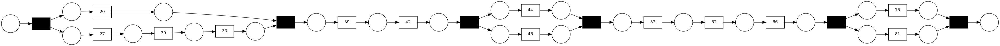

# GUIDO: Guideline Discovery & Ordering


This is the repository for the paper [GUIDO: A Hybrid Approach to Guideline Discovery & Ordering from Natural Language Texts](https://doi.org/10.5220/0012084400003541).

Provided features:
- training conventions for your own datasets
- logging and hyper parameter search using mlflow and hydra
- generalized rule based workflow net extraction for german texts

### Getting started:

Set up dependencies:
```
conda env create -f guido-cuda.yaml
conda activate guido-cuda
poetry install
spacy download de_dep_news_trf

pip install --upgrade git+https://github.com/huggingface/transformers.git
```


###  Sentence Classifier: Data + Training setup

- split labeled dataset:
```
python guido/preprocessor/split_data.py --data-path data/recipes/ger/all.jsonl --out-path data/recipes/ger/split \
--include-blogs False
```
- train classifier:
```
python guido/train_and_log.py
```

- perform grid search on learning_rate:
```
python guido/train_and_log.py --multirun mlflow.experiment_name=grid_search_
```

- visualize results:
```
mlflow ui
```

### Run GUIDO:

```
python guido/main.py --model-path=weights/sentence_bert/<model-name>
```

### Citation

Freyer, N.; Thewes, D. and Meinecke, M. (2023). GUIDO: A Hybrid Approach to Guideline Discovery & Ordering from Natural Language Texts.  In Proceedings of the 12th International Conference on Data Science, Technology and Applications, ISBN 978-989-758-664-4, ISSN 2184-285X, pages 335-342.  DOI: 10.5220/0012084400003541   

```
@conference{data23,
author={Nils Freyer. and Dustin Thewes. and Matthias Meinecke.},
title={GUIDO: A Hybrid Approach to Guideline Discovery & Ordering from Natural Language Texts},
booktitle={Proceedings of the 12th International Conference on Data Science, Technology and Applications - DATA},
year={2023},
pages={335-342},
publisher={SciTePress},
organization={INSTICC},
doi={10.5220/0012084400003541},
isbn={978-989-758-664-4},
issn={2184-285X},
}
```


