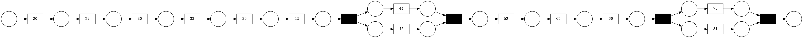

# recipe_1 

## Original Text:

Das Eisbein mit dem Suppengrün, Lorbeer, Wacholder und einer mit Nelken gespickten Zwiebel in einem großen Topf mit leichtem Essigsud ca. 1-1,5 Stunden leicht köcheln lassen. 
Parallel dazu in einer Pfanne den Speck auslassen, etwas Zwiebel andünsten und das Sauerkraut anbraten. 
Mit Lorbeer und Wacholder würzen und den kompletten Riesling angießen. 
Zugedeckt solange schmoren, bis der Wein vom Kraut aufgesogen wurde 
(dauert ca. 1 Stunde).Das 
Eisbein 
aus dem Essigsud nehmen und auf das Kraut setzen. 
Dann im Backofen bei 200°C garen und dabei immer mit dem Schwarzbier übergießen. 
Wenn es knusprig ist, ist es fertig (ca. 45 Minuten).Dazu 
Püree, zu 50% aus Kartoffeln und zu 50% aus Knollensellerie. 

## Summary: 

- Das Eisbein mit dem Suppengrün , Lorbeer , Wacholder und einer mit Nelken gespickten Zwiebel in einem großen Topf mit leichtem Essigsud ca 1 - 1,5 Stunden leicht köcheln lassen
- Parallel dazu in einer Pfanne den Speck auslassen , etwas Zwiebel andünsten und das Sauerkraut anbraten
- Mit Lorbeer und Wacholder würzen und den kompletten Riesling angießen
- Zugedeckt solange schmoren , bis der Wein vom Kraut aufgesogen wurde
- aus dem Essigsud nehmen und auf das Kraut setzen
- Dann im Backofen bei 200 ° C garen und dabei immer mit dem Schwarzbier übergießen

## Petri-Net: 

